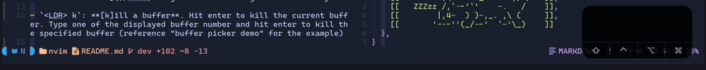

# Theovim


Theovim is my Neovim configuration, featuring opinionated base Vim settings, ~30 carefully selected plug-ins, and custom UI components written 100% in Lua.

Some Theovim philosophies that might convince you to use Theovim:

1. Prefer Neovim API and Lua over plug-ins
1. When plug-ins are used, keep the stock configuration as much as possible. The plug-in author knows more about the plug-in than I do
1. Always comment the code!
1. Avoid duplicate keybindings and features
1. 10 keybindings you can memorize are better than 50 complicated keybindings
1. Keep things minimal

## Dependencies

- *A terminal emulator capable of rendering 256 xterm colors*
- *`npm`, `g++` (`gcc-c++`), and `unzip` for `bashls` and `clangd` language server*
- *Neovim version > 0.8.0*
- *[NerdFonts](https://www.nerdfonts.com/font-downloads) to render glyphs*
- `git` to update Theovim

## Installation

```bash
# Optional backup
[[ -e ~/.config/nvim ]] && mv ~/.config/nvim ~/.config/nvim.bak
# Install Theovim files in ~/.config/nvim
git clone --depth 1 https://github.com/theopn/theovim.git ~/.config/nvim
```

## Features and Usage

File structure:

```
├── init.lua                        --> Module initializations
└── lua
    │
    ├── config.lua                  --> User configuration
    ├── core.lua                    --> Core functions (opt and keymaps)
    ├── misc.lua                    --> Miscellaneous Theovim features
    ├── plugins.lua                 --> Plug-in table, simple setup(), and Lazy bootstrap
    ├── util.lua                    --> Utilities for float win, vim.ui.select, etc.
    │
    ├── config
    │   └── ...                     --> Long plug-in setup() functions
    │
    ├── lsp
    │   ├── completion.lua          --> nvim-cmp and snippet init
    │   └── lsp.lua                 --> Neovim built-in LSP config and other LSP related features
    │
    └── ui                          --> Handmade Theovim UI elements
        ├── components.lua          --> Statusline and Winbar modules
        ├── dashboard.lua           --> Cute startup Dashboard
        ├── highlights.lua          --> Custom highlights used by UI components
        ├── statusline.lua          --> Simple global statusline
        ├── tabline.lua             --> Clean tabline with buffer and tab info
        └── winbar.lua              --> Simple Winbar to complement global statusline
```

### Keybindings

- Leader (`LDR`) key is the space bar (`SPC`) by default
- `jk`: ESC

- `<LDR> t`: **Make a new [t]ab**. Hit enter to make a new tab with the current buffer. Type one of the displayed buffer number and hit enter to make a tab with the specified buffer (reference "buffer picker screenshot" for the demo). If this is confusing, read [my article on Vim workflow](//TODO) to gain understanding of Vim's tab system

- `<LDR> k`: **[k]ill a buffer**. Hit enter to kill the current buffer. Type one of the displayed buffer number and hit enter to kill the specified buffer (reference "buffer picker demo" for the example)

<details>
  <summary>Buffer Picker Demo</summary>

  
</details>

### Telescope

- Reference the full README in //TODO
- File browser (`<LDR>fb`): 
- Find Files (`<LDR>ff`): Fuzzy finder for files in the current directory and subdirectories. Optionally, install [fd](https://github.com/sharkdp/fd) for better performance, `.gitignore` support, and other fd features.

### LSP

Error message

Completion

Formatting

Adding a new LSP server: 

- Theovim automatically installs [bashls](https://github.com/bash-lsp/bash-language-server), [clangd](https://github.com/clangd/clangd), [lua_ls](https://github.com/LuaLS/lua-language-server), [pylsp](https://github.com/python-lsp/python-lsp-server), and [texlab](https://github.com/latex-lsp/texlab)
- Browse `:Mason` or [nvim-lspconfig server list](https://github.com/neovim/nvim-lspconfig/blob/master/doc/server_configurations.md) for available LSP servers. Use `:MasonInstall <lsp-name>` and `:MasonUninstall <lsp-name>` commands to install/uninstall LSP server

### Markdown and LaTeX

- `:MarkdownPreviewToggle`: Toggle GitHub-style real-time markdown preview in your default browser
- `:VimtexCompile`: Toggle LaTeX compile and real-time preview on buffer save. You should specify and prepare the PDF viewer of your choice in `config.lua`. Currently, [Skim](https://skim-app.sourceforge.io/) (for MacOS) or [Zathura](https://pwmt.org/projects/zathura/) for Linux/MacOS are supported

```lua
vim.g.vimtex_view_method = "skim" --> or "zathura"
```

### Built-in UI Elements

Startup dashboard: launches when Neovim is opened with no argument. One of ASCII arts of my cat Oliver is randomly selected. You can operate each function using `hjkl` and enter key.

//TODO image of the dashboard in collapsible HTML element

Tabline:


Statusline: from left to right,

// image

```
| Mode | current working dir | file name [modified statu] | git information | ... | Linter status | Filetype | File format and encoding | line:column location in the buffer
```

Winbar:

### Miscellaneous Theovim Features

- Notepad
- TrimWhiteSpace
- ShowChanges
- Built-in documentation

- `:TheovimHelp` contains all the custom commands and shortcuts
- `:TheovimUpdate` updates the latest changes to Theovim by pulling the changes and running update utilities
- `:TheovimChangelog` for the current version information and latest changes

## Other Things

- Join (informal) Theovim user group [Discord server](https://discord.gg/er5EqNdkhH)

