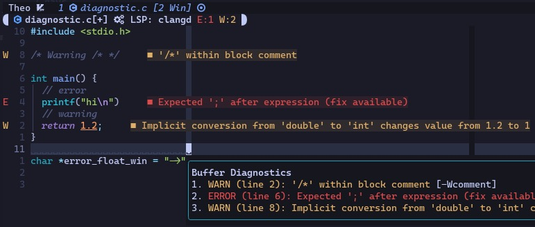

# Theovim

> If you are reading this document using `:TheovimReadme`, use `:MarkdownPreviewToggle` to render the contents in your browser.

<details>
    <summary>
    <b>TOC</b>
    </summary>

- [Theovim](#theovim)
  * [Overview](#overview)
  * [Dependencies](#dependencies)
  * [Installation](#installation)
  * [Features and Usage](#features-and-usage)
    + [Core Keybindings](#core-keybindings)
    + [Core Commands](#core-commands)
    + [Core Options](#core-options)
    + [Spell Check](#spell-check)
    + [Terminal Emulator](#terminal-emulator)
    + [LSP](#lsp)
      - [Diagnostics](#diagnostics)
      - [Completion](#completion)
      - [Linter (Code Formatting)](#linter--code-formatting-)
      - [Adding a New LSP Server](#adding-a-new-lsp-server)
    + [Telescope](#telescope)
    + [Markdown and LaTeX](#markdown-and-latex)
    + [Built-in UI Elements](#built-in-ui-elements)
      - [Notepad](#notepad)
      - [Startup Dashboard](#startup-dashboard)
      - [TabLine](#tabline)
      - [Winbar and StatusLine](#winbar-and-statusline)
    + [Miscellaneous Theovim Features](#miscellaneous-theovim-features)

[comment]: # (https://ecotrust-canada.github.io/markdown-toc/)

</details>


## Overview

Theovim is my Neovim configuration, geared toward my CS studies (C, Python, Java, LaTeX, LaTeX, and LaTeX).
It features opinionated base Vim settings and keybindings, ~30 carefully selected plug-ins, and custom UI components written 100% in Lua.

The philosophies I stick to when I configure Neovim are:

1. Prefer Neovim API and Lua over plug-ins
1. When you use a plug-in, keep the stock configuration as much as possible. The author knows more about the plug-in than you do
1. Always comment on the code!
1. Avoid duplicate keybindings and features
1. 10 keybindings you can memorize are better than 50 complicated keybindings
1. Keep things minimal

I don't advise using this repository as your personal config because it contains some opinionated features, and you can learn much about (neo)vim when you configure it yourself.

Instead, you are welcome to fork the repository or read/copy the source code. It contains some of my proud and interesting work, such as:

- [No-plug-in core config with memorable keybindings](./lua/core.lua)
- [TabLine](./lua/ui/tabline.lua)
- [Startup Dashboard](./lua/ui/dashboard.lua)
- [StatusLine](./lua/ui/statusline.lua) and [Winbar](./lua/ui/winbar.lua) [components](./lua/ui/components.lua)
- [Notepad, floating term, and custom menu using `vim.ui.select()`](./lua/util.lua)

I also wrote articles about some of my Neovim config components in my blog.

- [Using vim.ui.select to Group Features and Fix Keybinding Problems](https://theopark.me/writing/2023-07-22-vim-ui-select/)

**If you found Theovim helpful, please leave a star!**

## Dependencies

- **A terminal emulator with true color support**
    - [Wezterm](https://wezfurlong.org/wezterm/index.html) is my choice of terminal emulator.
    	It's fast, feature-rich, and configured in Lua
    - [Kitty](https://sw.kovidgoyal.net/kitty/), [Alacritty](https://alacritty.org/), and [iTerm 2 for MacOS](https://iterm2.com/) are great options
    - Alternatively, you can use a GUI Neovim client like [Neovide](https://neovide.dev/)
- **Neovim version > 0.8.3**
    - Unfortunately, my school's Debian server uses outdated Neovim, forcing me to use some deprecated APIs and older versions of plug-ins
    - These will be indicated in code comments and will be fixed as soon as possible
    - Thanks to my friend Shriansh for at least making them upgrade from 0.5 to 0.8
- **[NerdFonts](https://www.nerdfonts.com/font-downloads) to render glyphs**
- `npm`, `g++` (`gcc-c++`), and `unzip` for `bashls` and `clangd` language server
- `git` to update Theovim

## Installation

```bash
# Optional backup
[[ -e ~/.config/nvim ]] && mv ~/.config/nvim ~/.config/nvim.bak
# Install Theovim files in ~/.config/nvim
git clone --depth 1 https://github.com/theopn/theovim.git ~/.config/nvim
```

## Features and Usage

<details>
    <summary>
    <b>File structure</b>
    </summary>

```
├── init.lua                        --> Module initializations
└── lua
    │
    ├── config.lua                  --> User configuration
    ├── core.lua                    --> Core functions (opt and keymaps)
    ├── misc.lua                    --> Miscellaneous Theovim features
    ├── plugins.lua                 --> Plug-in table, simple setup(), and Lazy bootstrap
    ├── util.lua                    --> Utilities for float win, vim.ui.select, etc.
    │
    ├── config
    │   └── ...                     --> Long plug-in setup() functions
    │
    ├── lsp
    │   ├── completion.lua          --> nvim-cmp and snippet init
    │   └── lsp.lua                 --> Neovim built-in LSP config and other LSP-related features
    │
    └── ui                          --> Handmade Theovim UI elements
        ├── components.lua          --> Statusline and Winbar modules
        ├── dashboard.lua           --> Cute startup Dashboard
        ├── highlights.lua          --> Custom highlights used by UI components
        ├── statusline.lua          --> Simple global Statusline
        ├── tabline.lua             --> Clean tabline with buffer and tab info
        └── winbar.lua              --> Simple Winbar to complement global Statusline
```

</details>

### Core Keybindings

**Leader (`[LDR]`) key is the space bar (`SPC`)**.

- `j k` (insert): ESC

- `[LDR] a`: **Select [a]ll**
- `[LDR] /`: Clear the last search and search highlights

- Yank and paste:
    - `[LDR] y` (visual): Yank to the system clipboard
        ([unnamedplus](https://stackoverflow.com/questions/30691466/what-is-difference-between-vims-clipboard-unnamed-and-unnamedplus-settings))
    - `[LDR] p` (visual): Paste the selection without overriding the default register
        
    - `[LDR] p` (normal): Open a register (similar to clipboard history -- `:h registers`) selection
- Buffer navigation:
    - `[LDR] b`: **[b]uffer**. Open a buffer list
    - `[LDR] [`/`]`: Navigate to prev/next buffers
    - `[LDR] k`: **[k]ill buffer**. Delete a buffer. Hit enter to kill the current buffer or type buffer numbers
        
- Window resizing: Theovim does not offer many window resizing/navigation bindings since Vim already has `C-w` keybindings.
    Familiarize yourself with `C-hjkl`, `C-w` (for navigating to floating windows), `C-w =`, `C-w |`, etc.
    - `[LDR] +`/`-`: Increase/decrease the current window height by one-third
    - `[LDR] >`/`<`: Increase/decrease the current window width by one-third
- Tab navigation:
    - `[LDR] t`: **new [t]ab**. Create a new tab.
    Hit enter to make a new tab with the current buffer or type buffer numbers (reference the `[LDR] k` demo above)
    - `[LDR] q`: **[q]uit**. Close the current tab. (you cannot close the one and only tab. Use `C-w q` or `:q`)
    - `[LDR] 1`-`5`: Navigate to tab number 1 - 5
- Overridden keybindings: These are Vim keybindings overridden by Theovim
    - `gx`: Open URL in the current line (error notification if no URL found in the current line)
        - In Vim, this keybinding is provided by `netrw`, which is disabled in Theovim for a better file management plug-in
    - `n`/`N`: Cycle through search results and center the screen
        - Vim does not center the screen by default

### Core Commands

Many of these commands are accessible through `[LDR] m` keybinding (reference "Miscellaneous Theovim Features" section).

- `:TrimWhiteSpace`: Remove trailing whitespaces
- `:ShowChanges`: Show the difference between the saved file and the current Vim buffer
- `:CD`: You might launch Vim in `~` directory and open `~/foo/bar/baz/file.txt`. Use this command to change the working directory to `baz` (to narrow the Telescope search down, etc.). It only affects the current buffer. You can see the CWD and relative file path in the Statusline

### Core Options

- By default, tab characters are set to 2 spaces. For some filetypes, the value of `tabstop` will change (e.g., Java has a tab width of 4 characters)
- `listchars` rendering:
    
    - Tab character                     : Renders as `⇥ `
    - Two leading spaces (indentation)  : Render as `│ `
    - Trailing space                    : Renders as `␣`
    - Non-breaking space                : Renders as `⍽`
    - Beginning of a wrapped line       : Renders as `↪`
- In some filetype, `colorcolumn` (highlights a specific column) is enabled based on the language style convention. For example, in C/C++ buffers, the 80th column will be highlighted

- You can override any of the options in `core.lua` in your `config.lua`:
    ```lua
    -- Example of overriding options in config.lua
    vim.opt.scrolloff = 10 --> show at least 10 lines above/below from the current cursor, which is 7 lines by default
    vim.opt.confirm = false --> turn off confirm prompt when quitting with unsaved buffer, which is on by default
    ```

### Spell Check

- English spell check is supported via the Vim built-in spell check feature. Use the `:h spell` for more information
- Spell check is enabled by default in text filetypes (`*.txt`, `*.md`, `*.tex`, etc.).
    - You can turn spell check on in other buffers using the toggle keybinding

- `C-s`: **[s]pell**
    - (insert): Fix the nearest spelling error and put the cursor back
    - (normal): Bring up spell suggestions for the word under the cursor
- `[LDR] s t`: **[s]pell [t]oggle**. Toggle spell check

### Terminal Emulator

- `[LDR] z`: **[z]sh**. Prompts you for the location to launch a new terminal window (bottom, left, or right third, floating, new tab)
- Theovim uses Neovims built-in terminal emulator. For more information, `:h terminal`
- There are autocmd to:
    1. Automatically start the insert mode when terminal buffers open. Use `ESC` to escape to the normal mode
    2. Closes the terminal if the exit code is 0. Otherwise, you will get a notification, and the terminal window will persist until you hit enter

### LSP

When Winbar says you have an LSP server running in the buffer, you are in for a treat! Theovim uses the Neovim built-in LSP to provide modern IDE features.

The following keybindings are enabled when an LSP server is active in the current buffer:

- `[LDR] c d`: [c]ode **[d]oc**. Open a hover doc for the cursor item
- `[LDR] c r`: [c]ode **[r]name**. Rename the cursor item
- `[LDR] c e`: [c]ode **[e]rror**. List diagnostics in the current buffer
- `[LDR] c p`: [c]ode **[p]rev**. Navigate to the previous diagnostics
- `[LDR] c n`: [c]ode **[n]ext**. Navigate to the next diagnostics
- `[LDR] c a`: [c]ode **[a]ll**. Open the menu for other LSP features

Following features are accessible through `[LDR] c a`:

- Code action: Get a suggestion menu for LSP diagnostics
- References: See where the variable/function under the cursor was used
- Symbols: List all variables, functions, and other components that the LSP server detects for a quick navigation
- **To stop LSP server, use `:LspStop`**

Many LSP servers detect information from your code as well as system-wide libraries and project files in the same directory. If the LSP doesn't work as you wish, consult the LSP server documentation.

#### Diagnostics

Whenever an LSP server detects an error or has a suggestion for your code, Theovim will display the diagnostics status in your Winbar. Four types of diagnostics are: "Error", "Warning", "Hint", and "Info". For example, the below image is the `clangd` LSP server displaying warnings and an error for my C code.



You can get a list of current buffer diagnostics using `[LDR] c e`. You can navigate to the nearest diagnostics using `[LDR] c p`/`n`.

#### Completion


Theovim offers completion engines for LSP buffers as well as general text editing.

- `C-j`/`k`: Scroll through completion items
- `TAB`/`S-TAB`: Scroll through completion items
- `RET`: Confirm the selection
    - Or, once a completion item gets rendered on screen using `TAB` you can continue typing without hitting `RET`
- `C-[`/`]`: Scroll through completion documentation
- `C-e`: Close the completion window
- `C-n`: Manually open the completion menu

The order of completion item detection:

1. LSP engine (if applicable)
1. LuaSnip snippets
1. Neovim API (if applicable)
1. Buffer words
1. Path completion

    

There is also a Vim command line completion.


#### Linter (Code Formatting)

- Linter is available for some buffers when LSP servers provide formatting (`vim.lsp.buf.format()`)
- You can track the status of Linter in the Statusline component (reference the "Built-in UI" section below).
- When Linter is on, it will format the code every time you save. **You can turn this off using `:LspLinterToggle`**
- `LspLinterToggle` is a global option, meaning if you turn on/off Linter, it applies to all buffers
- It also does not have a memory, meaning when you turn Linter off and relaunch Neovim, it will be on again
- To disable Linter by default, add the following line to `config.lua`
    ```lua
    vim.g.linter_status = false
        ```

#### Adding a New LSP Server

- Theovim automatically installs
    [bashls](https://github.com/bash-lsp/bash-language-server),
    [clangd](https://github.com/clangd/clangd),
    [lua_ls](https://github.com/LuaLS/lua-language-server),
    [pylsp](https://github.com/python-lsp/python-lsp-server),
    and [texlab](https://github.com/latex-lsp/texlab)
- Browse `:Mason` or [nvim-lspconfig server list](https://github.com/neovim/nvim-lspconfig/blob/master/doc/server_configurations.md) for available LSP servers. Use `:MasonInstall <lsp-name>` and `:MasonUninstall <lsp-name>` commands to install/uninstall LSP server

### Telescope

[Telescope](https://github.com/nvim-telescope/telescope.nvim) is an awesome fuzzy finder for Neovim.

- `[LDR] ?`: **Help**. Open keymap fuzzy finder
- `[LDR] f b`: **[f]uzzy [b]rowser**. File browser in the fuzzy finder form. It's useful when you want to navigate to the parent directory
- `[LDR] f f`: **[f]uzzy [f]iles**. Fuzzy finder for files in the current directory and subdirectories. Optionally, install [fd](https://github.com/sharkdp/fd) for better performance, `.gitignore` support, and other fd features.
- `[LDR] f r`: **[f]uzzy [r]ecent**. Open recent file fuzzy finder
- `[LDR] f /`: **[f]uzzy [/]search**. Open fuzzy finder for current buffer words
- `[LDR] f a`: [f]uzzy **[a]ll**. Open the menu for other Telescope features

Following features are accessible through `[LDR] f a`:

- Search history
- Command history
- Commands (all available commands)
- Help tags (Vim built-in help documentation)
- Colorschemes

- `C-j`/`k` or `C-n`/`p`: Scroll Telescope items
- `C-d`/`u`: Scroll Telescope preview window
- `C-c` or `<ESC> <ESC>`: Close Telescope
- `<RET>`: Confirm Telescope selection

### Built-in UI Elements

#### Notepad

`:Notepad` opens a tiny, semi-transparent floating window in the top right corner. Here, you can write quick notes for your current Neovim sessions. As the Notepad warning suggests, the contents of the Notepad will persist *until you close the current Vim session*.


- Use `:w file-name.md` to save the current Notepad contents
- `q`/`<ESC>`: Hides the Notepad window
    - Using `:q` to close the Notepad messes up the closing mechanism

#### Startup Dashboard

When Neovim launches with no argument, you will be greeted with a Dashboard containing a randomly selected ASCII art of my cat Oliver. For the ASCII arts credit, please read the comments in [dashboard.lua](./lua/ui/dashboard.lua).


- `jk` or left/right arrow: navigate the Dashboard buttons
- `<RET>`: Confirm button selection
- You can navigate to other parts of the Dashboard using a mouse or other navigation keys. However, the buffer is unmodifiable and will not function unless the cursor is on one of the buttons. `jk` will take you to the first or last button if the cursor is out-of-place

#### TabLine

Theovim's TabLine improves the built-in Vim tab system with tab number, modified indicator, and number of tabs and buffers.


- Tab title displays current buffer file name as long as there is one
- Number of windows includes floating windows or windows for unlisted buffers (e.g., `:Notepad` scratch buffer, file tree, help, etc.)
- Number of buffers does not include unlisted buffers

#### Winbar and StatusLine


Winbar components:

- File name
- Modified ([+]) or read-only ([-])
- LSP server name (if an LSP server is active)
- LSP diagnostics information (if an LSP server is active)

```
| filename.c[+] LSP: server_name E:5 W:1 HINT:4 INFO:5 |
```

StatusLine components:

- Current mode
- Current working directory
- File path and name relative to the CWD
- Git branch and lines changed
- Linter status (if an LSP server is active)
- Filetype
- File format (UNIX or DOS icon)
- Current line and column number + percentage through file of displayed window

```
| N |  CWD  foo/bar.c[+]  branch +13 ~20 -36       Linter ON  FILETYPE  file_format:encoding  line:col page_percentage
```

### Markdown and LaTeX

- `:MarkdownPreviewToggle`: Toggle GitHub-style real-time markdown preview in your default browser
- `:VimtexCompile`: Toggle LaTeX compile and real-time preview on buffer save. You should specify and prepare the PDF viewer of your choice in `config.lua`. Currently, [Skim](https://skim-app.sourceforge.io/) (for MacOS) or [Zathura](https://pwmt.org/projects/zathura/) for Linux/MacOS are supported
    ```lua
    vim.g.vimtex_view_method = "skim" --> or "zathura"
    ```

### nvim-tree and Oil

- `[LDR] n`: Toggle `nvim-tree`

### Miscellaneous Theovim Features

- `[LDR] g`: **[g]it** Menu for Git-related functionalities (status, diff, commits, etc.)
- `[LDR] m`: **misc**. Menu for miscellaneous Theovim features

- `:TheovimUpdate` updates the latest changes to Theovim by pulling the changes and running update utilities
- `:TheovimReadme`: Opens this document in a floating window
- `:TheovimChangelog`: View the current version information and latest changes
- `:TheovimChangelogHistory`: View the historic changelogs

