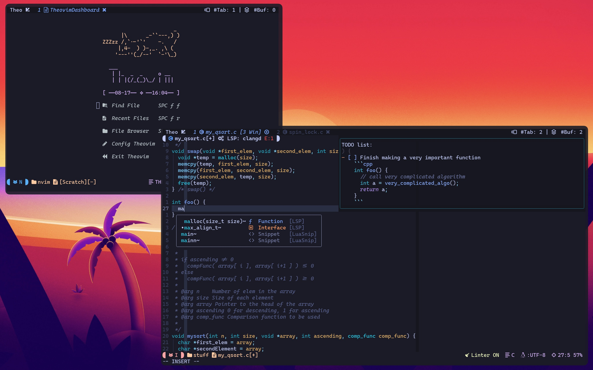

# Theovim



Theovim is:

- My personal Neovim configuration. I use it everyday for almost every text editing

Theovim is my personal Neovim configuration. It strives to be a simple and maintainable full-Lua Neovim configuration with full-IDE feature.
Due to the requests from my classmates in CS252: Systems Programming who wanted IDE features while working on the infamous "shell project," I decided to take the Neovim configuration out of my [dotfiles repository](https://github.com/theopn/dotfiles). I also like the name Theovim it's cute.

## Prerequisite

- `git` to update Theovim
- `bash` or a POSIX compliance shell
- A terminal emulator capable of rendering 256 xterm colors
- Latest version of Neovim (> 0.8).
  - For those poor souls working with 0.4.3 version Neovim on Purdue CS Data server, I included the appimage downloader that automatically adds alias to your `.bashrc`. Run `~/.theovim/nvim_appimage_downloader.sh` periodically to keep the appimage updated.
- [NerdFonts](https://www.nerdfonts.com/font-downloads) to render glyphs

## Installation

- Install the latest version of Neovim. Use `nvim_appimage_downloader` if your system does not permit a binary installation

Execute the following commands:

```bash
git clone https://github.com/theopn/theovim.git $HOME.theovim
$HOME/.theovim/theovim-util.sh install
```

## Usage

- `:TheovimHelp` contains all the custom commands and shortcuts
- `:TheovimUpdate` updates the latest changes to Theovim by pulling the changes and running update utilities
- `:TheovimInfo` shows the current version and information about the Neovim/Theovim

## Highlights


